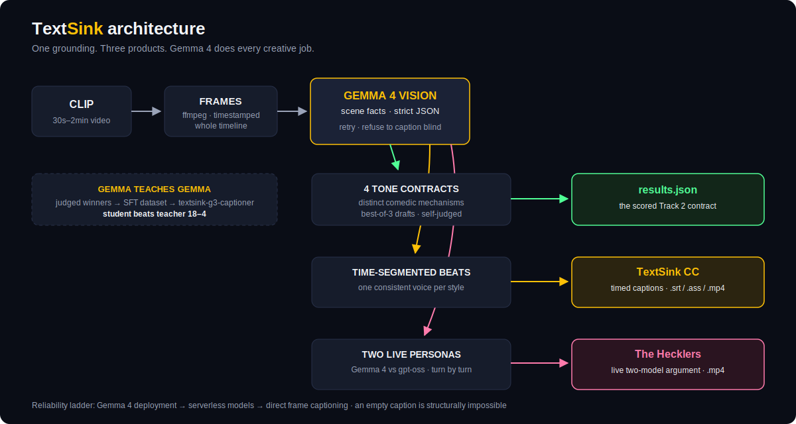

# TextSink

**Four voices. One truth.**

AMD Developer Hackathon: ACT II — Track 2 (Video Captioning), built for the
**Best Use of Gemma** challenge. One 30s–2min clip goes in; four
perfectly-toned captions come out — plus live styled closed captions and
two AIs arguing about what they're watching.


*One clip, four voices — formal, sarcastic, humorous-tech,
humorous-non-tech — rendered as live closed captions. Every word grounded
in what's actually on screen. Every word written by Gemma 4.*

## What the judges' harness gets (Track 2 contract)

The container implements the standard Track 2 flow:

```
/input/tasks.json  ->  /output/results.json
```

```json
[{"task_id": "v2",
  "captions": {
    "formal": "An orange tabby kitten walks forward through the foliage toward the camera in a wooded area.",
    "sarcastic": "A fierce predator emerges from the brush, clearly ready to conquer the entire forest one tiny, uncoordinated step at a time.",
    "humorous_tech": "The latest AI agent successfully navigating its first training environment. It's small, but the feature set is looking promising.",
    "humorous_non_tech": "A tiny orange explorer makes a grand entrance, bravely navigating the treacherous jungle of backyard leaves."}}]
```

Those are real outputs from the official sample clips, generated end-to-end
by **Gemma 4** (`gemma-4-26b-a4b-it`, 26B MoE) on a dedicated Fireworks
deployment — the same model does the visual grounding AND all four styles.

## For judges — what actually runs, and Gemma's real role

> Full authorship receipts, artifact by artifact:
> **[GEMMA_PROVENANCE.md](GEMMA_PROVENANCE.md)** (90-second read).

**The reality in one sentence:** Gemma 4 is deploy-only on Fireworks and
our deployment is account-scoped — so if the grading harness injects its
own API key, the container detects that at startup and transparently runs
its serverless fallback, logging the served path to stderr:

```
[main] probe: Gemma deployment reachable - all-Gemma run          # our key
[main] probe: deployment unreachable (404 ...) - switching to serverless models   # foreign key
```

**Gemma's contributions to this entry are structural, not cosmetic:**

- the four-style prompt architecture, comedic mechanisms, and grounding
  discipline were developed and validated on Gemma 4 against the official
  clips (every sample output and demo asset in this repo is Gemma 4's);
- Gemma 4 generated AND self-judged the SFT dataset that trained
  `textsink-g3-captioner` — the self-distillation loop, with receipts
  (`ab_results.json`, methodology in `tools/ab_clean.py`);
- the fallback path inherits every Gemma-developed mechanism unchanged —
  verified end-to-end in
  [`submission/fallback_verification/`](submission/fallback_verification/)
  (forced foreign-key run: 3 official clips, 62s, zero empty captions).

**Why this should score well on the rubric:**

- **Accuracy** — captions may only use extracted scene facts; empty
  grounding → retry → refuse-to-caption-blind → reroute.
- **Tone** — four distinct comedic mechanisms per contract, not one
  prompt with four adjectives; blind-sortable by design.
- **Quality** — best-of-3 drafts, self-judged on accuracy + tone, winner
  ships.
- **Auditability** — the run itself logs which model served every stage.

## Why it isn't vanilla

**1. Grounding you can trust.** Frames are sampled across the whole clip
and Gemma 4 extracts scene facts as strict JSON. If grounding comes back
empty, TextSink retries at rising temperature and **refuses to caption
blind** rather than hallucinating. Captions may only use extracted facts.

**2. Four voices with different comedic mechanisms** (not one prompt with
four adjectives): formal = broadcast precision; sarcastic = deadpan
scale-mismatch irony; humorous-tech = the scene mapped onto dev culture;
humorous-non-tech = warm "we've all been there" relatability.

**3. Gemma teaches Gemma — and the student wins.** Gemma 4 drafted
candidate captions at high temperature, judged its own drafts on
accuracy + tone, and the winners became a self-distilled training set
(`tools/build_dataset.py`). We fine-tuned `textsink-g3-captioner`
(Gemma-3-27B LoRA, Fireworks managed SFT) on those 60 judged winners.

The honest numbers (raw data in `ab_results.json`, methodology in
`tools/ab_test.py` + `tools/ab_clean.py`): of 60 caption pairs, the
neutral judge (gpt-oss-120b) returned parseable scores for both sides on
31; on those the tuned model wins **18–4 head-to-head** (9 ties) and
scores higher on every style. Two disclosed caveats: (a) LLM-judge
scoring is noisy — unparseable rows are excluded, not imputed; (b) the
training set was distilled from the official sample clips, which is
deliberate, rules-permitted distribution targeting — the contest
publishes its clip source, and fine-tuning on it is the point of
"build your own dataset." Judge our claims against the raw file.

**4. Live closed captions (TextSink CC).** The same grounding, segmented
into time beats — each style becomes a real timed CC track (`.srt` +
`.ass` + burned video) with one consistent voice and running gags.

**5. The Hecklers — two models argue about the video.**


Every line is generated live, turn by turn: **Gemma 4** plays the lead,
**gpt-oss-120b** plays the rival, each reading the argument so far.
Three flavors matching the contest styles: STAN & GUS (sarcastic old men),
LINT vs VIBE (code reviewer vs vibe-coder), DORIS & PEARL (neighbors over
the fence). Spice dial goes to eleven; grounding rules still apply.

## Quickstart

```bash
cp .env.example .env          # add your FIREWORKS_API_KEY

# Prebuilt image (linux/amd64) - no build needed:
docker pull ghcr.io/banksythequantlab/textsink:latest

# Or build it yourself (harness mode - what gets graded)
docker buildx build --platform linux/amd64 -t textsink .
docker run --rm -e FIREWORKS_API_KEY=fw_... \
  -v "$(pwd)/test_input:/input:ro" -v "$(pwd)/out:/output" textsink

# Local, no Docker (needs Python 3.11 + ffmpeg on PATH)
pip install -r requirements.txt
INPUT_PATH=test_input/tasks.json OUTPUT_PATH=results.json python main.py

# Offline wiring test - no API key needed
python run.py --input clip.mp4 --mock
```

### The fun stuff

```bash
# Styled closed captions: .srt + .ass + burned video, all four voices
python tools/textsink_cc.py --clip clip.mp4 --out cc_out --burn

# Two AIs arguing about your video, spice up to eleven
python tools/hecklers.py --clip clip.mp4 --burn --spice eleven --flavor sarcastic
python tools/hecklers.py --clip clip.mp4 --burn --flavor humorous_tech
python tools/hecklers.py --clip clip.mp4 --burn --flavor humorous_non_tech

# Single-caption kinetic-type renders + the 2x2 four-voices grid
python tools/render_captions.py --results results.json --clips clips/ --grid
```

## Architecture



Reliability at judging time: the primary path is the Gemma 4 dedicated
deployment (`REASONING_EFFORT=none` — it emits a thought preamble
otherwise). If the deployment is cold or unreachable under the grader's
key, `main.py` cuts over per-task to serverless models
(`qwen3p7-plus` vision + `gpt-oss-120b` captions) so no task scores zero.
Full transparency on the Gemma claim: no serverless Gemma exists on
Fireworks (we checked — deploy-only), so the survival fallback is
necessarily non-Gemma. The container **prints which model served every
stage to stderr** ("probe: Gemma deployment reachable — all-Gemma run"),
so whether a given graded run was all-Gemma is verifiable from its own
logs, not our word.
Clips run 4-at-a-time; 3 official clips complete in ~30s warm — far
inside the 10-minute harness budget.

## Repo map

| Path | What it is |
|---|---|
| `main.py` | graded entry: `/input/tasks.json` → `/output/results.json` |
| `run.py` | CLI: folder/clip → captions.json (`--mock` for offline) |
| `captioner/` | pipeline: frames, vision grounding, styles, judge, client |
| `tools/textsink_cc.py` | styled closed-caption tracks (the product) |
| `tools/hecklers.py` | two models argue about the video |
| `tools/render_captions.py` | kinetic-type caption burner + 2x2 grid |
| `tools/build_dataset.py` | Gemma-teaches-Gemma SFT dataset generator |
| `eval/run_eval.py` | self-eval: accuracy + tone via LLM judge |

MIT licensed. Built with Gemma 4 on Fireworks AI for the AMD Developer
Hackathon: ACT II.
